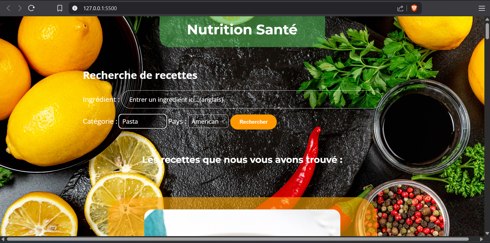

🍽️ Projet IBIS

Application de recherche de recettes avec l'API TheMealDB

Pour essayer en direct :
https://quentin384.github.io/Projet-IBIS/

---

🚀 Objectif du projet

Développer une interface utilisateur robuste et performante permettant d’interroger l’API TheMealDB, d’analyser les réponses reçues et d’afficher dynamiquement des recettes en fonction de critères variés :

Catégorie

Pays d’origine

Ingrédients

Recettes aléatoires

Ce projet s’inscrit dans un cadre pédagogique visant à renforcer les compétences en développement frontend, en intégration d’API et en collaboration.

---

🛠️ Fonctionnalités clés

🔍 Recherche de recettes par catégorie, origine, ingrédient ou de façon aléatoire

📋 Affichage des listes de recettes avec images et titres

📄 Consultation des détails complets d’une recette : instructions, ingrédients, vidéo de préparation, etc.

📱 Interface responsive, conçue pour être utilisable sur desktop comme sur mobile

⚙️ Code structuré, modulaire, clair et bien commenté

---

🧪 Stack technique

API : TheMealDB

Méthodologie : Travail en binôme, feedbacks réguliers, approche itérative

---

🧭 Organisation du projet

📅 Durée : 8 demi-journées de développement (hors rendu final)

👥 Travail en binôme avec accompagnement du formateur

📈 Présentations d’avancement régulières

📚 Utilisation de ressources en ligne et documentation technique

---

✅ Critères de performance

Fonctionnalités conformes au besoin client

Intégration maîtrisée de l’API (gestion des promesses, erreurs, chargement)

Interface fluide, responsive et agréable à utiliser

Code propre, lisible, structuré et documenté

Présentation finale claire, synthétique et professionnelle

---

📂 Livrables

🎯 Interface utilisateur fonctionnelle (recherche + affichage des recettes)

💻 Code source propre et commenté

📑 Documentation technique des choix d'implémentation

🎤 Présentation orale (10 min) en binôme

---

👥 Évaluation

Revue de code continue et feedbacks intermédiaires

Démo finale face à un "client fictif"

Évaluation des compétences techniques et collaboratives

Auto-évaluation croisée entre binômes

---

📎 Liens utiles

Documentation API : https://www.themealdb.com/api.php

Références JS (fetch, async/await, DOM)

Guides UI/UX pour interface responsive

--- 

📌 Auteurs

👨‍💻 Réalisé par : Quentin – Étudiant développeur Fullstack Java / JS

📅 Projet individuel – avril 2025

"Un bon développeur ne code pas pour la machine, il code pour l’humain qui lira après lui."
– Adapté de Martin Fowler
